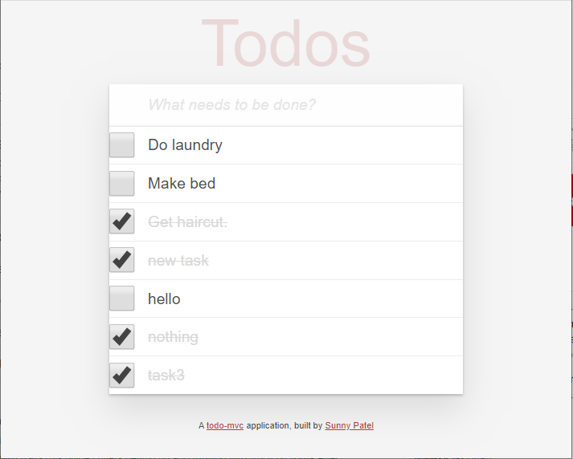

# Todo App

This is a clone of Todo application (http://todomvc.com/)  implemented with ruby on rails framework, javascript using test driven development approach. It is a great example of learning various javascript concepts while getting hold of building various tests to application functionalities.  

The application allows users to create To-do list. Each task in To-do list will be shown with a checkbox. A Ticked checkbox along with strike through line will indicate a task is completed. 

This app uses ajax request to load,create & update tasks in the database   

## [Try it yourself](https://todo-sunny-patel.herokuapp.com) 


## Getting Started

These instructions will get you a copy of the project up and running on your local machine for development and testing purposes. See deployment for notes on how to deploy the project on a live system.

### Prerequisites

You will need to setup Vagrant environment to run the application on local machine. To find the installation instructions for your OS, visit :

```
https://github.com/FirehoseProject/firehose-vagrant-rails5
```
### Installing

Initiate the vagrant environment.

Git clone the repository to your local machine in the src folder :

HTTPS:
```
$ git clone https://github.com/spp1991/todoapp.git
```

SSH:

```
$ git clone git@github.com:spp1991/todoapp.git
```

Open application folder created by git clone command:

```
$ cd todoapp
```

Install all the gems used in application:

```
$ bundle install
```

Install the application database and create all the tables:

```
$ rails db:create
$ rails db:migrate
```

You will then be able to start the app locally by runnning:

```
$ rails server -b 0.0.0.0 -p 3000
```

## Built With

* [Ruby on Rails](https://rubyonrails.org/) - Web framework
* [PostgreSQL](https://www.postgresql.org/) - Database
* [HTML5](https://en.wikipedia.org/wiki/HTML5) - Web markup language
* [CSS3](http://www.css3.info/) - Webpage Style Sheet language
* [Bootstrap](https://getbootstrap.com/) - CSS Framework
* [Javascript](https://www.javascript.com/) - Web Programming language
* [jQuery](https://jquery.com/) - Javascript Framework
* [Amazon Web Service](https://aws.amazon.com/) - Cloud Storage Platform 
* [rSpec](https://rspec.info/) - Ruby gems



